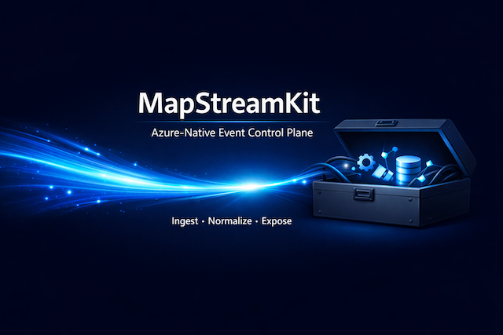
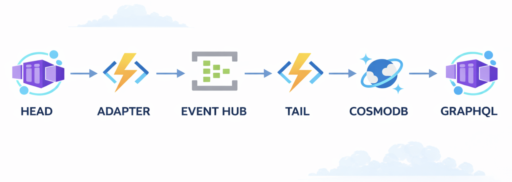

# MapStreamKit




## Overview
 An Azure-native event ingestion and control-plane system that pulls data from external APIs, normalizes it, and exposes it through a GraphQL consumer layer, leveraging Azure services like Event Hubs, Cosmos DB, and Blob Storage. Infrastructure is provisioned and managed with Terraform.



⚙️ Processing Pipeline:  
→ Head Pullers (Container App) fetch source data  
→ Adapter Layer validates, envelopes, and publishes events  
→ Azure Event Hubs (stream backbone)  
→ Tail Processor (Function App) consumes, transforms, deduplicates  
→ Cosmos DB stores canonical + raw documents  
→ GraphQL Service exposes query access to clients  

📦 Azure resources include:  
→ Resource Group  
→ Event Hubs Namespace  
→ Cosmos DB (serverless)  
→ Storage Account  
→ Key Vault  
→ Managed Identities  
→ Log Analytics + Application Insights  
→ Azure Container Apps (Head + GraphQL)  
→ Azure Function App (Tail)  
→ Azure Container Registry  
→ RBAC assignments  

🚀 Deployment Model:  
Infra →  
→ iac – provision/update infrastructure  
→ release-head – build/push Head image + deploy  
→ release-graphql – build/push GraphQL service  
Runtime →   
→ image build + ACR push  
→ container revision rollout  

🛠️ Current State:  
The platform foundation is operational 🎉

Working:  
✅ Terraform infra provisioning  
✅ Event pipeline connectivity  
✅ RBAC + managed identity flow  
✅ Container deployment pipeline  
✅ GraphQL service live and queryable  
✅ Health/serviceInfo checks  
✅ Head service deployable and health-testable  
✅ Observability via App Insights / Log Analytics

Still MVP / scaffold:  
🔶 full ETL semantics  
🔶 advanced dedupe/versioning  
🔶 adapter library maturity  
🔶 schema automation  
🔶 multi-source orchestration

☁️ What the Platform Enables Today:  
Rapidly spin up event ingestion environments (dev/stage/prod)  
Validate external API ingestion strategies  
Test rate-limit handling, pagination, schema mapping  
Validate identity, RBAC, and deployment flows  
Evaluate payload normalization strategies  
Prototype event-driven data platforms  

🏆 It is currently best suited for:  
Testing candidate external APIs  
Evaluating ingestion complexity  
Designing normalization strategies  
Validating data contracts before production pipelines

## Prerequisites
- [Terraform >= 1.5.0](https://www.terraform.io/downloads.html)
- [Azure CLI](https://docs.microsoft.com/en-us/cli/azure/install-azure-cli)
- Contributor access to the target Azure subscription
- Adjust variables as needed for your environment.

## Azure Resource Provider Registration (required)
Before running Terraform, ensure your subscription is registered for required resource providers (one-time per subscription):

```sh
az provider register --namespace Microsoft.Storage
az provider register --namespace Microsoft.EventHub
az provider register --namespace Microsoft.KeyVault
az provider register --namespace Microsoft.DocumentDB
az provider register --namespace Microsoft.Insights
az provider register --namespace Microsoft.ManagedIdentity
az provider register --namespace Microsoft.App
az provider register --namespace Microsoft.AlertsManagement
```

## Quickstart
Run from repository root:

```sh
# 0) First-time config setup (create local config files)
cp infra-bootstrap/bootstrap.auto.tfvars.example infra-bootstrap/bootstrap.auto.tfvars
cp env/dev/backend.hcl.example env/dev/backend.hcl
cp env/dev/dev.tfvars.example env/dev/dev.tfvars

# 1) Edit config values for your environment
# - set your org/env/location
# - ensure tfstate storage account name is globally unique
# - keep names lowercase where required by Azure resources

# 2) Authenticate once per session
az login
az account set --subscription "<SUBSCRIPTION_ID>"

# 2) One-command full workflow (preflight + bootstrap + infra)
./scripts/iac.sh dev all
```

Script details and rationale: [scripts/README.md](scripts/README.md)

## Runtime release workflows

Release scripts run from repository root.

Prerequisite: infrastructure must already exist for the target environment.

```sh
./scripts/iac.sh dev infra
```

Use `all` instead of `infra` on first setup when bootstrap resources are not created yet.

Head (Container App image build + push + deploy):

```sh
./scripts/release-head.sh dev [image_tag]
```

GraphQL (Container App image build + push + deploy):

```sh
./scripts/release-graphql.sh dev [image_tag]
```

Both scripts resolve ACR in this order:
- `ACR_NAME` env var (explicit override)
- Terraform output `acr_name` for the target environment
- Existing Container App image
- Single-ACR subscription fallback

By default, ACR is managed by Terraform per environment (for reproducible, isolated releases).

CI workflows:
- `.github/workflows/head-release.yml`
- `.github/workflows/graphql-release.yml`

### Architecture
```
MapStreamKit/
├─ README.md
├─ infra-bootstrap/  # creates tfstate RG + storage + container (runs with local state)
│  ├─ providers.tf
│  ├─ main.tf
│  ├─ outputs.tf
│  └─ variables.tf
├─ infra/                         # main stack (uses azurerm backend)
│  ├─ providers.tf
│  ├─ variables.tf
│  ├─ main.tf
│  ├─ outputs.tf
│  ├─ backend.tf                  # declares azurerm backend (configured via backend.hcl)
│  └─ .gitignore                  # or root .gitignore
├─ runtime/
│  ├─ head/                       # Head Puller: pull external APIs, build envelopes, POST to Adapter
│  ├─ adapter/                    # Adapter: POST /events -> Event Hubs (internal-only)
│  ├─ tail/                       # Tail Processor: EventHubTrigger -> validate -> map -> Canonical Store
│  └─ graphql/                    # GraphQL Consumer runtime + Dockerfile
└─ tooling/
   ├─ schema-registry/            # (later) manage payload schemas (Blob)
   └─ graphql-gen/                # (later) generate GraphQL/types from canonical model
```

### Dataflow (MVP)
```
        V V V
         \|/
+---------o---------+       POST /events       +-----------------------+
| Head Pullers      |------------------------->| Adapter               |
| (AF In Container) |                          | (Function App)        |
| - pull providers  |                          | - validate envelope   | 
| - build envelope  |                          | - produce to Event Hub|
+-------------------+                          +-----------+-----------+
      ^                                                    |
      |                                                    |
      |                                                    v
      |                                              +----------------------+
      |                                              | Azure Event Hubs     |
      |                                              | hub: eh-msk-events   |
      |                                              | CG: processor        |
      |                                              +----------+-----------+
      |                                                         |
      |                                                         v
      |                                               +------------------+
      |                                               | Tail Processor   |
      |                                               | (EventHub Func)  |
      |                                               | - validate env   |
      |                                               | - validate payload
      |                                               | - map canonical
      |                                               | - dedupe in Cosmos (id = f(dedupeKey))
      |                                               +---------+--------+
      |     +---------------------------+                      /|
      |     | Checkpoint Store + DLQ    |<--------------------/ |
      |     +---------------------------+                       V
      |                                               +---------------------------+
      |                                               | Canonical Store (Cosmos)  |
      |                                               | db: msk                   |
      |                                               | container: raw_envelopes  |
      |                                               | pk: /partitionKey         |
      |                                               +---------------------------+   
      |                                                           ^
      |                                                           |
      V                                                           V
+---------------------------------+                   +------------------------------+   
|      Registrar Job              |                   | GraphQL Consumer             |          
| - reads deploy events           |<----------------->| - consumes registrar updates |         
| - validates & updates contracts |                   | - refreshes query schema     |
+---------------------------------+                   +--------------o---------------+
                                                                    /|\ 
                                                                   V V V
```

Naming note: Tail Processor is a backend Event Hubs consumer/mapper; client-facing reads are served by the GraphQL Consumer.

- All core Azure resources are provisioned via Terraform modules in `infra/`.
- See each `.tf` file for resource details and outputs.

---


## Getting Started
To set up MapStreamKit infrastructure step by step (if you don't want to use the Quickstart)
1. Authenticate with Azure:
   ```sh
   az login
   az account set --subscription "<SUBSCRIPTION_ID>"
   ```
Then follow the appropriate step-by-step instructions in:
- `infra-bootstrap/README.md` (for remote state backend bootstrap)
- `infra/README.md` (for main infrastructure deployment)

Each README contains the most up-to-date commands and configuration guidance for its respective module.

---

## Roadmap
Backlog index: [Backlog](backlog/README.md)
Execution plan: [Implementation Plan](backlog/implementation-plan/README.md)

- [x] Core infra (Event Hubs, Cosmos, Storage, Key Vault, Identities)
- [ ] Production hardening (security, networking, observability, guardrails) — [Production Hardening Backlog](backlog/production-hardening/README.md)
- [ ] Runtime code scaffolding (Head Puller, Adapter, Tail Processor, GraphQL Consumer) — [Runtime Scaffolding Backlog](backlog/runtime-scaffolding/README.md)
- [ ] Tooling (schema registry, GraphQL codegen) — [Tooling Backlog](backlog/tooling/README.md)

---

## License
MIT
